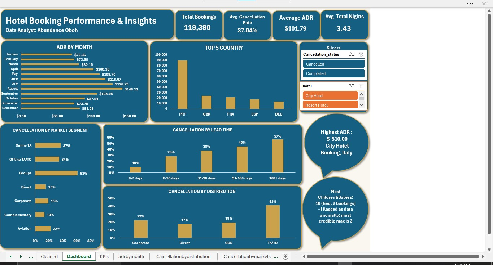
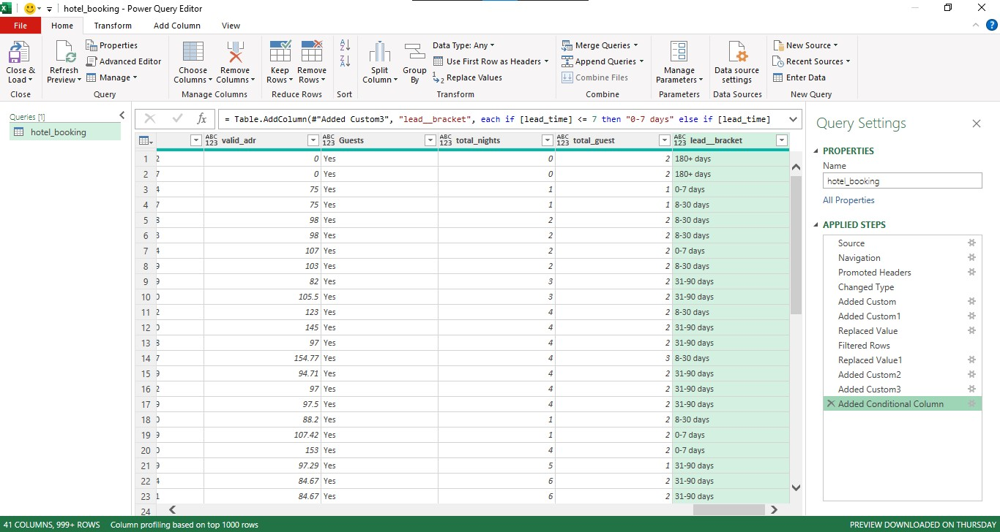
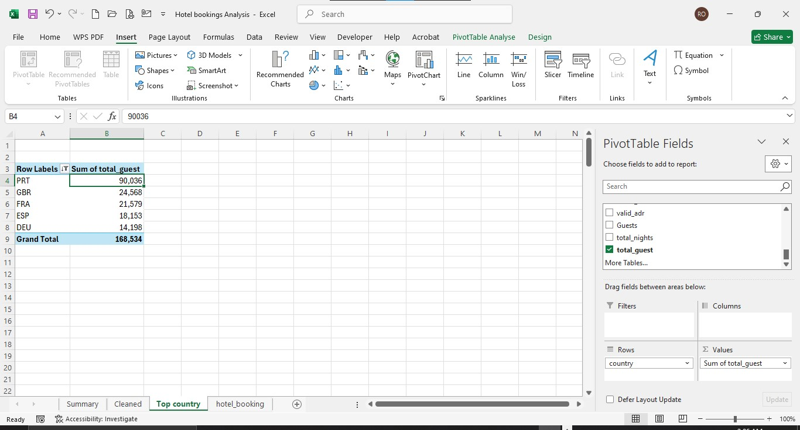
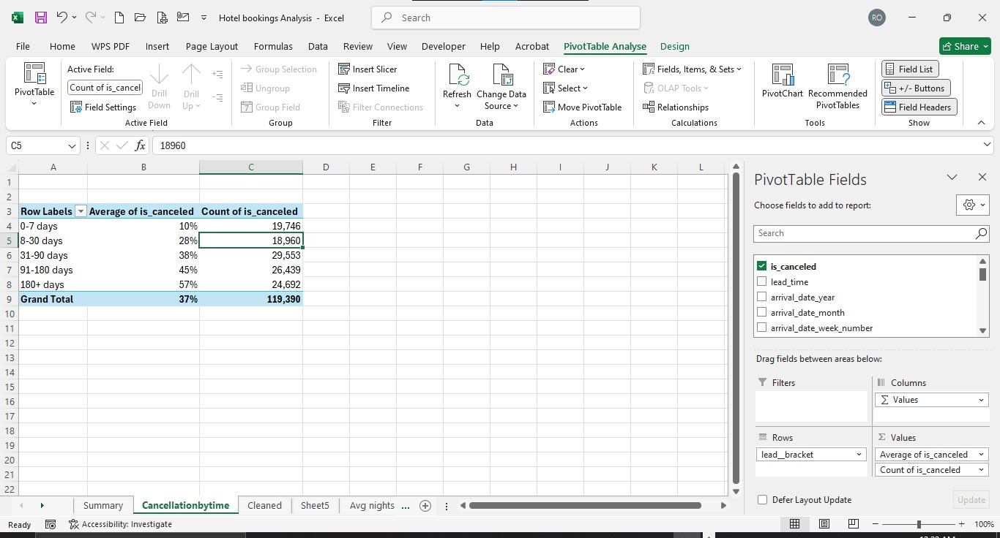
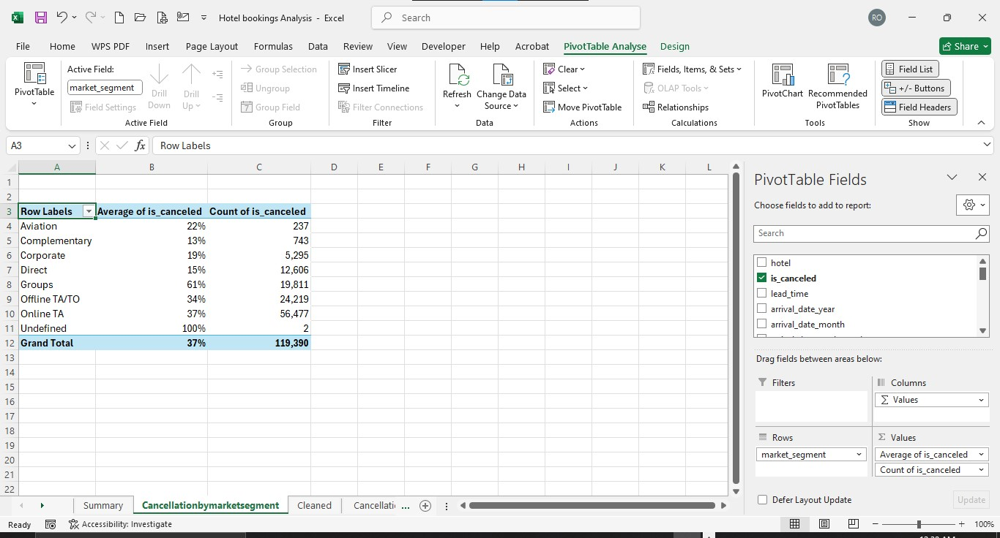
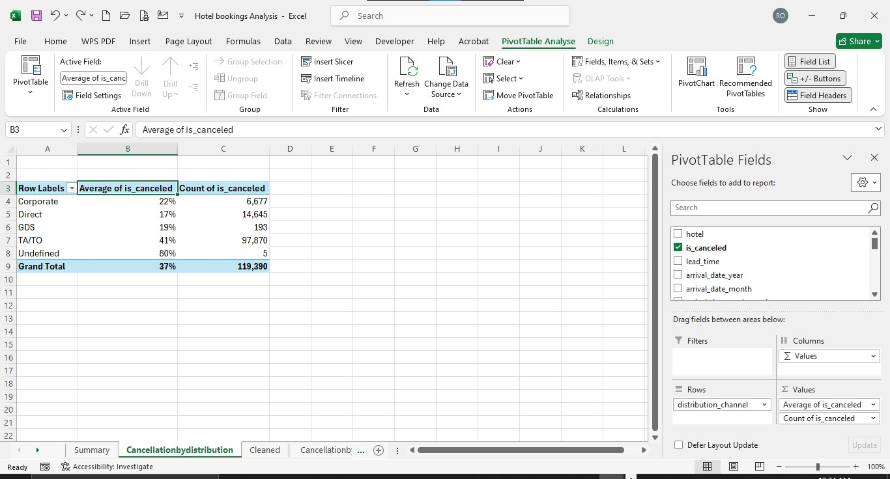
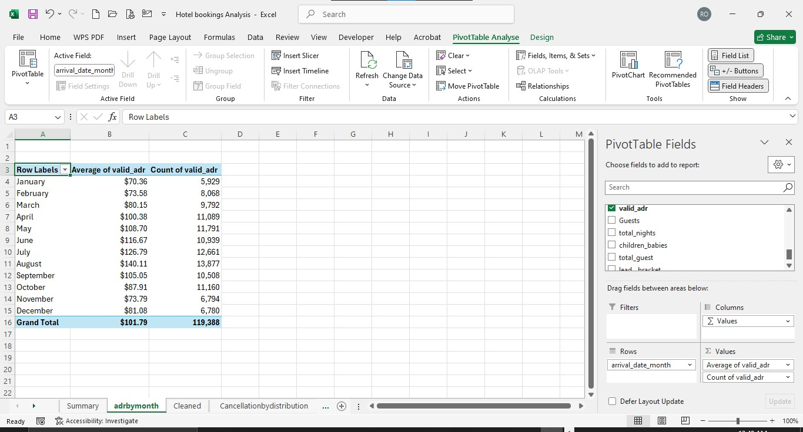

# Hotel Booking Analysis

**Analyst:** Abundance Oboh
**Tools:** Microsoft Excel, Power Query
**Dataset:** Hotel Bookings — 119,390 records, City Hotel and Resort Hotel, July 2015–August 2017

---

## Project Overview

This project analyzes hotel booking data to answer 5 core business questions plus 3 self-directed questions on demand, pricing, and cancellation behavior:

1. Which country do most travelers come from?
2. Who has the most ADR (Average Daily Rate)? How much?
3. What is the mean total ADR?
4. What is the average number of nights spent?
5. Who booked the hotel with the most children and babies?
6. *(Self-directed)* Does cancellation rate vary by booking lead time?
7. *(Self-directed)* Does cancellation rate vary by market segment or booking channel?
8. *(Self-directed)* How does ADR vary by month/season?

*Interactive Excel dashboard with KPI cards, cancellation/hotel slicers, and charts covering all 8 questions.*

📊 [Download the full Excel workbook]((https://docs.google.com/spreadsheets/d/1XFoTJW12WFYDVtFJzv9yQZneF2-p26Nt/edit?usp=drivesdk&ouid=109816520819276604582&rtpof=true&sd=true)) (hosted on Google Drive — file exceeds GitHub's size limit for direct hosting)

---

## Data Cleaning (Power Query)

All cleaning was performed in Power Query for full reproducibility.

**Key cleaning decisions:**

| Issue Found | Fix Applied | Why |
|---|---|---|
| ADR outliers: $5,400 (vs. genuine max of $510) and -$6.38 | Added `Valid_ADR` field, nulling out both values | Both fall far outside the realistic range (bulk of data $62–$126) and are almost certainly data entry errors. Nulling (not deleting the rows) preserves the other 35 fields of valid data for each booking. |
| 180 bookings with 0 total guests (0 adults, 0 children, 0 babies) | Added `Has_Guests` flag (Yes/No) | Logically invalid — flagged rather than deleted, since it's a small share (0.15%) of the data and only affects guest-composition questions. |
| 488 missing `country`, 4 missing `children` values | `country` → "Unknown"; `children` → 0 | Genuine blanks confirmed at the cell level. `children` defaulted to 0 (not "Unknown," which isn't valid for a numeric field) given the negligible row count and that 0 is already the overwhelming majority value. |
| `name`, `email`, `phone-number`, `credit_card` are artificially generated (per source documentation) | No cleaning applied — flagged as non-identifying | Duplicate names (up to 48 repeats) and duplicate emails are expected artifacts of random generation, not data errors. These fields are never used to identify "the same guest" across bookings. |
| `is_canceled` (0/1) not readable as a dashboard slicer | Added `Cancellation_Status` field ("Cancelled"/"Completed") | Provides clean, readable slicer labels instead of raw binary values. |

**Derived fields added:** `Valid_ADR`, `Has_Guests`, `Total_Nights`, `Total_Guests`, `Lead_Time_Bucket`, `Cancellation_Status`.

---

## Key Findings

### 1. Top 5 Countries by Travelers
**Portugal (90,036 travelers)** dominates — nearly 4x the next-highest country (UK, 24,568), followed by France, Spain, and Germany. Expected, since both hotels are located in Portugal.

### 2. Highest ADR
**$510.00** — a City Hotel booking from a guest in Italy. *(Reported by hotel/country, not by name, since `name` is an artificially generated field, not a real identifier.)*

### 3. Mean Total ADR
**$101.79**, after excluding the two ADR data errors described above.

### 4. Average Nights Spent
**3.43 nights** across all bookings; **3.39 nights** among completed stays only. The gap connects directly to Finding 6 below — longer-lead-time bookings cancel more often, and tend to represent longer planned stays.

### 5. Most Children and Babies
Data shows a maximum of **10**, tied across 2 bookings — but this is flagged as a likely data error, not a genuine finding: both records show only 2 adults, and there's a sharp statistical gap between 3 children/babies (111 bookings, plausible) and 9–10 (3 bookings total, isolated outliers). **Most credible maximum: 3.**

### 6. Cancellation Rate by Lead Time
A clean, strong pattern — cancellation rate rises from **10% (0–7 days out)** to **57% (180+ days out)**, a 5.7x increase, across large sample sizes at every step.

### 7. Cancellation Rate by Market Segment & Channel
**Groups (61%)** cancel roughly 4x more often than **Direct bookings (15%)**. By channel, **Travel Agent/Tour Operator (41%, 82% of all bookings)** cancels more than twice as often as **Direct (17%)**. Direct bookings are consistently the most reliable channel across both breakdowns.

### 8. ADR by Month/Season
A clear seasonal curve — rates climb from **$70.36 in January** to a peak of **$140.11 in August**, then decline back to **$73.79 by November**, consistent with expected Portuguese tourism seasonality.

---

## Business Recommendations

- **Prioritize direct booking channels** — lowest cancellation risk (15–17%) and no third-party commission.
- **Apply lead-time and channel-based deposit policies** — the risk gap is large enough (10% to 57%; 15% to 61%) to justify differentiated cancellation terms rather than a flat policy.
- **Use the seasonal ADR pattern to inform shoulder-season pricing** (April, September, October) to smooth demand.
- **Flag the Q5 data anomaly for source verification** before using it in any real guest-services planning.

---

## Data Limitations

- `name`, `email`, `phone-number`, `credit_card` are artificially generated and not used as real identifiers anywhere in this analysis.
- Two ADR values and one guest-count field required correction/flagging, handled via derived fields rather than row deletion to preserve the rest of each record.
- Findings reflect this specific dataset's period (2015–2017) and two Portuguese hotels; may not generalize elsewhere.

---

## Files in This Repo

- `images/` — dashboard and process screenshots referenced above
- Full Excel workbook: see Google Drive link above (https://docs.google.com/spreadsheets/d/1XFoTJW12WFYDVtFJzv9yQZneF2-p26Nt/edit?pli=1&gid=783351461#gid=783351461)
